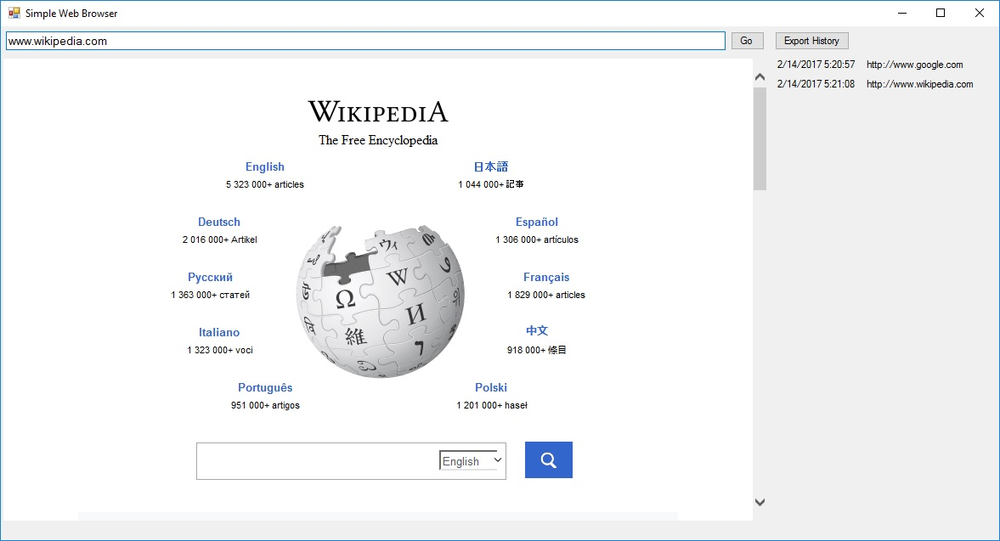

# A Simple Web Browser Using C# and WinForms
- Browses to the specified URL
- Keeps a non-persistent history of pages visited
- Can export the history to a JSON formatted file



# Dependencies

This project depends on the [Newtonsoft Json.NET](http://www.newtonsoft.com/json) third party library.  You can install it with the Visual Studio Package Manager:

```
PM> Install-Package Newtonsoft.Json -Version 9.0.1
```

